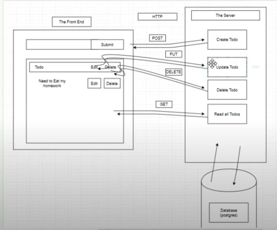

# Full Stack To-Do List

A Fill Stack PERN Application (PostgreSQL, Express, React, Node) that explores RESTful API's in a CRUD (Create, Read, Update, Delete) App that takes and stores to-do notes for a user.



---

## How to Run

Clone this repo, make sure you have Node.js installed, and if using a mac, have the homebrew manager installed.

Then in the command line, navigate to the [**Server**](server) directory, and type:

```
brew install postgresql
```

```
npm install
```

This will install the dependencies needed, and install the PostgreSQL database application. You will then need to run PostgreSQL on your local machine by typing int he command line:

```
psql
```

Then open up the [**database.sql**](database.sql) file and copy the `CREATE DATABASE` and `CREATE TABLE` commands into the psql command line. This will create your database and your table to store the descriptions of the to-do notes.

---
